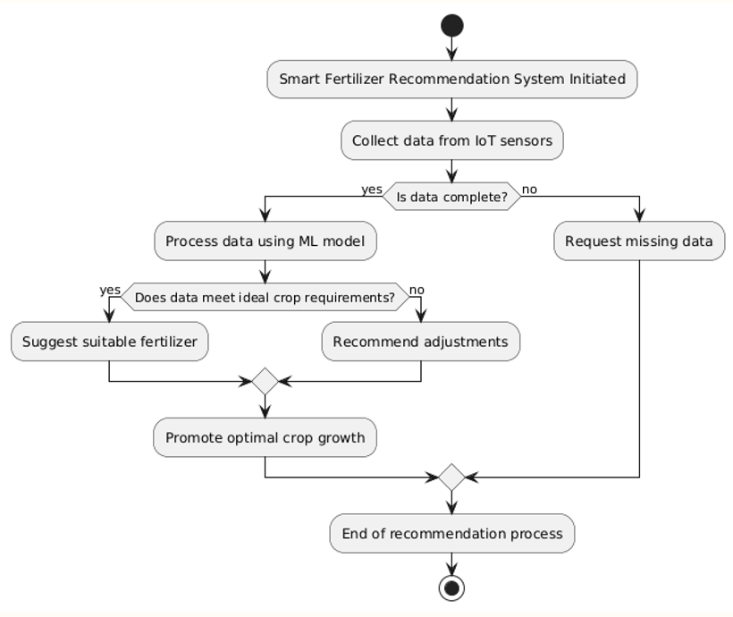
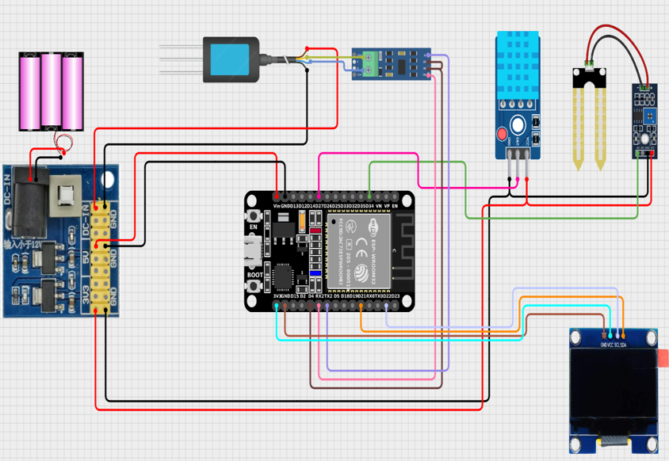

# 🌱 Smart Fertilizer Recommendation System

**AGRICURE = Productivity + Profit + Planet**  

An IoT-powered, AI/ML-driven system that provides **real-time, precise, and crop-specific fertilizer recommendations** to farmers. Our goal is to **boost yields, lower costs, and ensure sustainable farming** — all through data-driven, location-aware insights.  

---

## 🚜 Problem Statement

Farmers often lack **accurate information** about the quality and quantity of fertilizers required for their crops.  
This leads to:

- Nutrient imbalance in soils
- Reduced crop yield and soil degradation
- Environmental pollution from excess fertilizer use
- Rising production costs (~18% for small farmers)
- Inefficient farming practices causing economic losses

> **Fact:** Over 40–60% of applied nitrogen and phosphorus never reaches plants — it pollutes waterways or escapes as greenhouse gases.

---

## 💡 Solution Overview

The **Smart Fertilizer Recommendation System** integrates **IoT sensors + Machine Learning** to deliver **real-time advisory** to farmers.

1. IoT Sensors measure soil NPK, moisture, pH, temperature, and humidity.
2. ML algorithms compare real-time readings with ideal crop requirements.
3. The system outputs the exact fertilizer type and quantity needed.

**Key Benefits**:
- Boost yield by 20–30%  
- Reduce input costs via precision delivery  
- Promote climate-smart, sustainable practices  

---

## 🔄 System Workflow

  
*Real-time sensing → Cloud Processing → ML Prediction → Farmer Dashboard → Precision Fertilizer Delivery*

---

## 🖥️ Tech Stack

**Frontend:**
- React.js + TypeScript  
- Tailwind CSS

**Backend & APIs:**
- Python (Flask / FastAPI)  
- Node.js

**Machine Learning:**
- Python + Scikit-learn

**Database & Cloud:**
- Supabase – Data storage  
- ThingSpeak – IoT Data ingestion

**Hardware:**
- ESP32  
- NPK Sensor (RS485)  
- Soil Moisture Sensor  
- DHT11  
- SH1106 OLED

---

## ⚙️ Schematic Diagram

  
*ESP32 integrated with sensors, display, and cloud connectivity*

---

## 🌍 Target Users
- Smallholder farmers (1–10+ hectares)
- Commercial farms optimizing fertilizer usage
- Agribusinesses & cooperatives

---

## 📊 Market & Impact
- 14 crore hectares cultivable land in India  
- ₹31K Cr projected Agri-Tech market by 2033  
- 70% soils nutrient-deficient  
- Potential to boost yield by 20–30% and lower cost significantly

---

## ✨ Features
- 🌐 Multi-language support  
- ⚡ Instant sensing  
- ☁ Climate-smart adaptation  
- 📈 Data-driven forecasting  
- 🎯 Precision delivery (Variable Rate Application)  
- 🖥 Rich dashboard with alerts  

---

